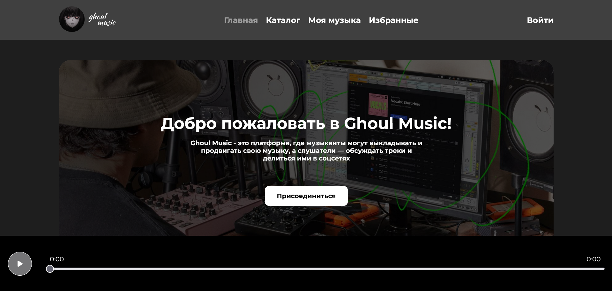

<h1 align='center'>𝕲𝖍𝖔𝖚𝖑 𝕸𝖚𝖘𝖎𝖈</h1>

<p align='center'>
  
</p>
<p align='center'>
  
</p>


<hr />
<br />

<h2 align='center'>𝖋𝖗𝖔𝖓𝖙𝖊𝖓𝖉</h2>

<p align='center'>React, Redux-Toolkit, Axios, SCSS, Animate.css</p>
<br />
<h2 align='center'>𝖇𝖆𝖈𝖐𝖊𝖓𝖉</h2>
<p align='center'>MongoDB, Mongoose, Express, Multer, UUID</p>
<br/>
<h2 align='center'>.𝖊𝖓𝖛 (𝖋𝖗𝖔𝖓𝖙𝖊𝖓𝖉)</h2>

```
REACT_APP_API_URL = your_api_url
```
<br />
<h2 align='center'>.𝖊𝖓𝖛 (𝖇𝖆𝖈𝖐𝖊𝖓𝖉 /𝖘𝖊𝖗𝖛𝖊𝖗)</h2>

```
PORT = your_port (default 5000)
DATABASE_URL = 'your_mongodb_database_url'
```
<br />

<h2 align='center'>ᴇɴᴊᴏʏ :3</h2>